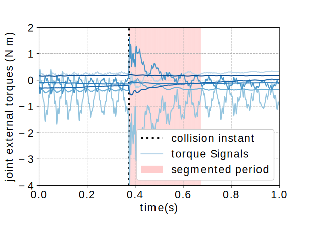
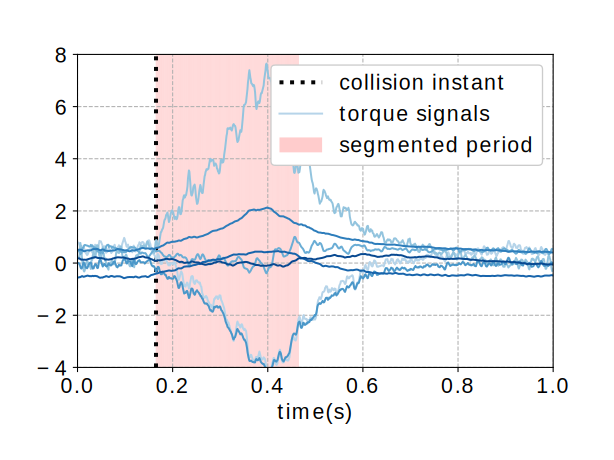
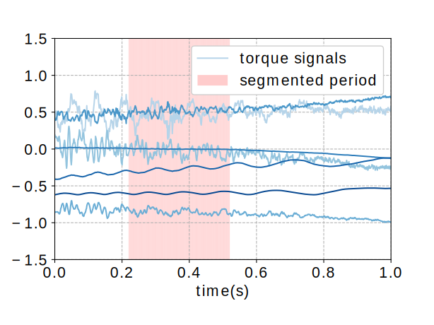

# robocol-detect

**Author:** *Zengjie Zhang* (z.zhang3@tue.nl)

Real-time robot collision detection using supervised learning methods

## Introduction

Safety is a critical issue for human-robot collaborative tasks, especially when humans have physical contacts with robots. Different types of pHRI exert various impacts on humans. The intentional contacts desired by the cooperative tasks, such as the human teaching processes, are usually quite safe. On the contrary, the accidental collisions, which may lead to unexpected injuries or damages, are often dangerous to humans. The accidental collisions are inevitable in pHRI and should be carefully handled. Especially, the reaction strategy for the accidental collisions should be distinguished from the intentional contacts since they tend to cause opposite consequences, which motivates the research on collision event handling. 

An important component of collision handling is collision detection and identification (CDI) which renders a classification problem between *accidental collision*, *intentional contact*, and *no contact* instances. Since collisions with robots can be measured by the torque sensors installed on their joints, CDI can be achieved by analyzing the torque sensor signals. **Fig. 1** shows three signal segments of the three instances as an example. It can be see that the waveforms of the signals of these three instances have different time and spectrum features which can be used as an evidence to achieve accurate classification.





**Figure 1. The comparison of the joint torques between *collision*, *contact*, and *no contact*.**

This benchmark uses four supervised learning models, namely $k$-nearest neighbors (knn), feedforward neural network (fnn), random forest (rf), and support vector machine (SVM) to compose an accurate real-time collision detector. The technical details can be referred to in the following publication:

**Zhang, Zengjie, Kun Qian, Björn W. Schuller, and Dirk Wollherr. "An online robot collision detection and identification scheme by supervised learning and Bayesian decision theory." IEEE Transactions on Automation Science and Engineering 18, no. 3 (2020): 1144-1156.**

Also, refer to the following public online dataset for the original sensor data to support your research:

**Zhang, Zengjie. “The Robot Joint Torque Measurements for Accidental Collisions and Intentional Contacts”. Zenodo, April 14, 2022. https://doi.org/10.5281/zenodo.6461868.**

## Installation

### Requirements

- Operating System: no specific requirements
- Python: test passed on `python=3.10`, with required Packages: 
    - `scikit-learn`
    - `matplotlib`
    - `numpy`
- MATLAB: some scripts may need the matlab engine. Some functions may be deprecated by the latest MATLAB versions. Refer to the official MATLAB documents for details.

### File structure

- `dataset/`: the refined data used for this benchmark;
- `feature/`: the Python scripts used to visualize feature engineering;
- `figs/`: folder of figures;
- `scr/`: common source code;
- `grid_validate/`: train and grid-validate a machine learning model (to determine the best structure and hyper-parameters);
- `train_and_test/`: train and test a machine learning (ML) model.

### Quick Guide
 
1. Install Python environment;
    ```
    pip install .
    ```

2. Train and validate ML models using grid search:
    - Run the main script `example/main.py`;
    - Watch the terminal for runtime information;
    - The figures will show up at the end of running; They are also automatically saved in the root directory;
    - The figures may impede each other; Drag the figures for a better view;
    - Check out the logging file `INFO.log` for the runtime information.

3. Train and test a ML model

## License

This project is with a BSD-3 license, refer to `LICENSE` for details.
